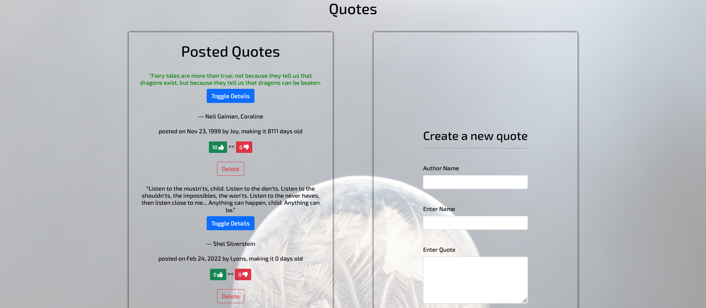

# QuotesApp

## A peek of the page

## Description

This is an Angular cli application, It allows the user to input new quote for other user to read, upvote a quote , downvote and also delete a quote. 
This project was generated with [Angular CLI](https://github.com/angular/angular-cli) version 13.2.2.

## Live Page 
click here to view the site [https://lyonsmasawa.github.io/Qoutes-App/]

## Development server

Run `ng serve` for a dev server. Navigate to `http://localhost:4200/`. The app will automatically reload if you change any of the source files.

## Code scaffolding

Run `ng generate component component-name` to generate a new component. You can also use `ng generate directive|pipe|service|class|guard|interface|enum|module`.

## Build

Run `ng build` to build the project. The build artifacts will be stored in the `dist/` directory.

## Running unit tests

Run `ng test` to execute the unit tests via [Karma](https://karma-runner.github.io).

## Running end-to-end tests

Run `ng e2e` to execute the end-to-end tests via a platform of your choice. To use this command, you need to first add a package that implements end-to-end testing capabilities.

## Further help

To get more help on the Angular CLI use `ng help` or go check out the [Angular CLI Overview and Command Reference](https://angular.io/cli) page.

## Installation / Setup instruction

* git clone from this link (https://github.com/Lyonsmasawa/Goals.git)

* Edit to your satisfaction

## Technologies Used

* HTML5
* CSS
* AngulerCLI
* markdown
* Bootstrap 

## Known Bugs
* No Known bugs yet

## Contact Information 

Reach out to me at this address [lyonsmasawa@gmail.com]

## License
MIT license[https://github.com/Lyonsmasawa/Qoutes-App/blob/d75160ce7805874350c8597fd966589ba354bb1b/LICENSE]
